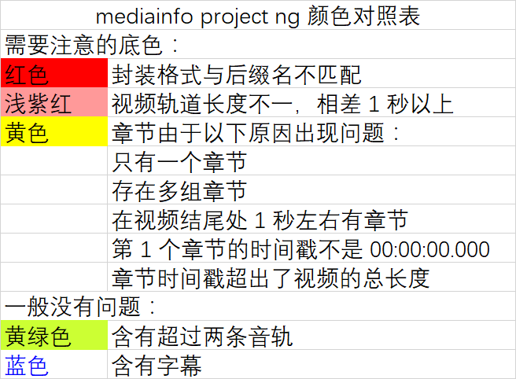

# [mediainfo project ng](https://bitbucket.org/TautCony/mediainfo-ng)

*Read this in other languages: [English](README.md), [简体中文](README.zh-cn.md)*

Next negeration of mediainfo project, group members are currently encouraged to use this version.

## Developer

Anlof

## Requirements

Most of the requirements are already packed in compressed files.
Requirement need manually installed are in bold.

1. [MediaInfo.dll](https://mediaarea.net/en/MediaInfo/Download)

## Usage

Drag media files into window.

## Cautions

**1. Color Lookup Table**

**2.** You can double click one single file for explanation on color.