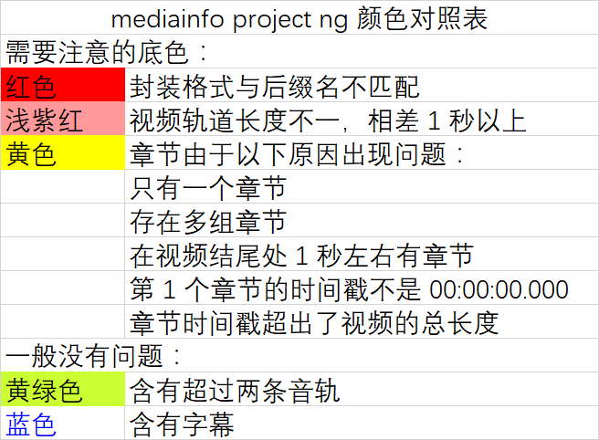

# [mediainfo project ng](https://bitbucket.org/TautCony/mediainfo-ng)

*其他语言版本: [English](README.md), [简体中文](README.zh-cn.md)*

新一代的mediainfo project,是目前被推荐使用的版本。

## 开发者

安洛夫

## 环境需求/依赖

大部分依赖已经随程序主体打包。
需要手动安装的会以粗体标注。

1. [MediaInfo.dll](https://mediaarea.net/en/MediaInfo/Download)

## 用法

将多媒体文件拖入窗口。

## 注意事项

**1. 颜色对照表**

**2.** 你可以双击单行文件获得关于显示颜色的提示。